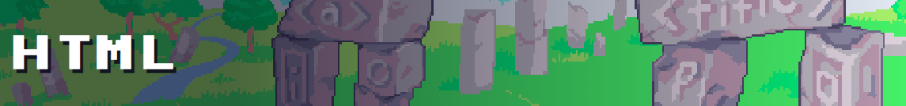
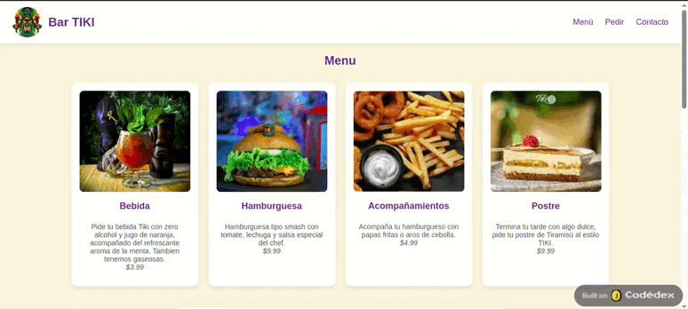

This repository contains the exercises and projects completed during the [Codedex](https://www.codedex.io/@CrisU8) course. Throughout the course, I learned the fundamentals of HTML and basic CSS, including semantic structure, form elements, and styling techniques. The repository showcases my progress and understanding of how to build and style web pages, and includes a final project that brings together all the concepts covered.

---

HTML (HyperText Markup Language) is the standard language used to create and structure content on the web. It allows developers to define the elements of a web page such as headings, paragraphs, images, links, and more.
This course is divided into four main chapters:

## [Structure](./structure)
In this chapter, we explored the basic building blocks of HTML such as headings, paragraphs, links, lists, and basic forms. We also had a brief introduction to styling with CSS.

## [Forms](./forms)
This chapter focused on form-related elements and the different types of user input fields, such as text boxes, radio buttons, checkboxes, and dropdowns. We also learned how to apply basic validation to these fields to ensure correct data input.
    
## [Semantic HTML](./semantic-html)
In this chapter, we covered HTML elements that give structure and meaning to a web page. We explored elements such as `<header>`, `<footer>`, `<main>`, `<section>`, `<article>`, `
`, and ``.

## 🧑‍💻 [Final Project ](./final_project) 
For the final project, I built a complete web page using all the concepts learned throughout the course. The project includes a responsive layout, semantic structure, styled components, and interactive forms.

### 🔗 Live website: [View Project](https://www.codedex.io/Helq3Aw3B4jj11HDtFnV/live)

📸 Project Preview:

